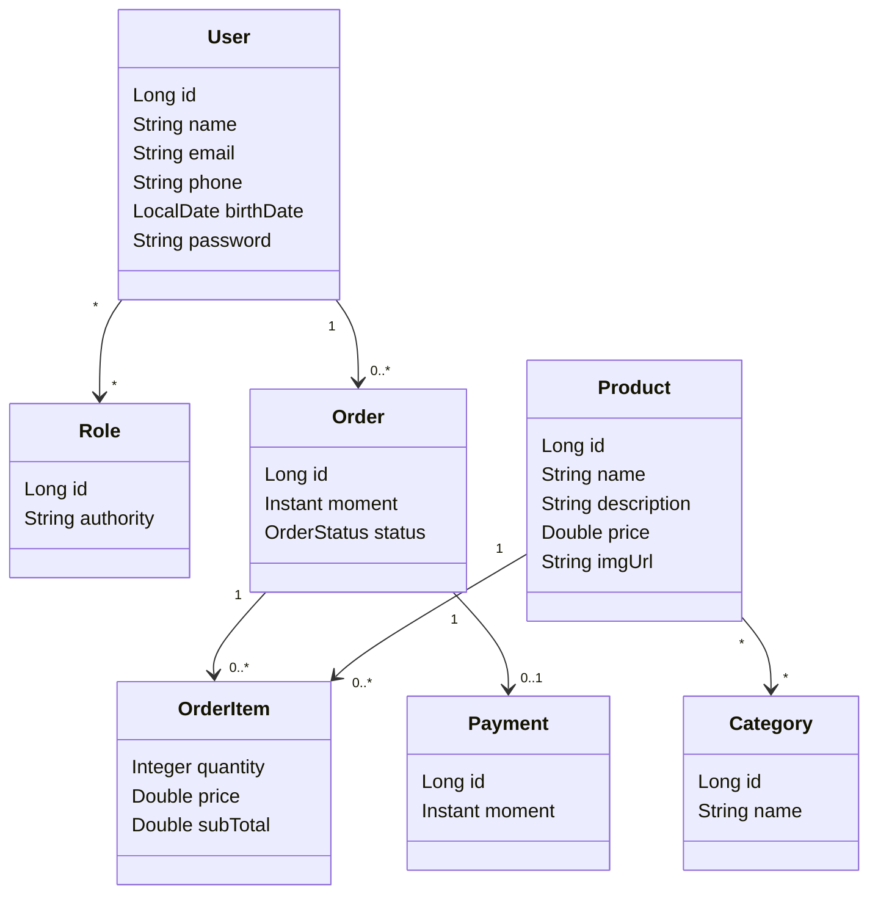

# DSCommerce

Este repositório contém a resolução do desafio **DSCommerce**, desenvolvido no capítulo 5 do curso **Java Spring Professional**, com foco em **login, autenticação com OAuth2/JWT e controle de acesso com Spring Security**.

O projeto implementa uma API REST de comércio eletrônico estruturada em camadas, com cadastro e consulta de produtos, categorias, usuários, pedidos, itens de pedido, pagamento e regras de autorização baseadas em perfis de acesso.

## Sobre o desafio

O desafio propõe a implementação do projeto **DSCommerce** com todas as funcionalidades apresentadas nas aulas do capítulo de login e controle de acesso.

A aplicação deve permitir:

- Consulta pública de produtos;
- Consulta pública de categorias;
- Login de usuários com retorno de token JWT;
- Controle de acesso por perfis de usuário;
- Operações privadas de produtos restritas a usuários administradores;
- Consulta do usuário logado;
- Consulta e criação de pedidos;
- Restrição para que clientes não acessem pedidos de outros usuários;
- Persistência em banco H2 para testes e validação local.

## O que foi cobrado

O desafio solicitava que o projeto fosse entregue estruturado, com banco de dados H2 e histórico mínimo de commits no GitHub.

Os principais critérios funcionais foram:

- Mínimo de 12 commits no GitHub;
- `GET /products` funcionando sem necessidade de login;
- `GET /products/{id}` funcionando sem necessidade de login;
- Endpoint de login funcionando e retornando token de acesso;
- `POST /products`, `PUT /products/{id}` e `DELETE /products/{id}` funcionando somente para usuário `ADMIN`;
- `GET /users/me` retornando o usuário logado;
- `GET /orders/{id}` funcionando para usuários autorizados;
- `POST /orders` funcionando para criação de pedidos;
- Usuário não administrador impedido de acessar pedidos de outros usuários;
- `GET /categories` retornando todas as categorias.

## Modelo de domínio

O domínio do projeto foi organizado em torno de usuários, perfis, produtos, categorias, pedidos, itens de pedido e pagamentos.



### Principais entidades

A entidade `User` representa os usuários da aplicação. Ela implementa `UserDetails`, permitindo integração com o Spring Security.

A entidade `Role` representa os perfis de acesso do sistema. Ela implementa `GrantedAuthority`, permitindo que as permissões sejam reconhecidas pelo mecanismo de autorização do Spring.

A entidade `Product` representa os produtos disponíveis no catálogo. Um produto pode estar associado a várias categorias.

A entidade `Category` representa as categorias dos produtos.

A entidade `Order` representa um pedido realizado por um usuário cliente.

A entidade `OrderItem` representa um item de pedido, usando chave composta por pedido e produto.

A entidade `Payment` representa o pagamento associado a um pedido.

## Perfis de acesso

O projeto utiliza dois perfis principais:

| Perfil | Descrição |
|---|---|
| `ROLE_CLIENT` | Usuário cliente, autorizado a consultar seus próprios pedidos e criar novos pedidos. |
| `ROLE_ADMIN` | Usuário administrador, autorizado a gerenciar produtos e acessar pedidos de qualquer usuário. |

A base de testes inclui os seguintes usuários:

| Usuário | E-mail | Senha | Perfis |
|---|---|---|---|
| Maria Brown | `maria@gmail.com` | `123456` | `ROLE_CLIENT` |
| Alex Green | `alex@gmail.com` | `123456` | `ROLE_CLIENT`, `ROLE_ADMIN` |

As senhas são armazenadas no banco de dados com **BCrypt**, evitando persistência de senha em texto puro.

## Segurança da aplicação

O projeto utiliza **Spring Security**, **OAuth2 Authorization Server**, **OAuth2 Resource Server** e **JWT** para autenticação e autorização.

O fluxo principal é:

1. O usuário envia suas credenciais para o endpoint de login;
2. O Authorization Server valida o `client-id`, o `client-secret`, o usuário e a senha;
3. Em caso de sucesso, a aplicação gera um token JWT;
4. O cliente envia esse token nas próximas requisições usando `Authorization: Bearer <token>`;
5. O Resource Server valida o token e aplica as regras de acesso dos endpoints.

## Controle de acesso

O controle de acesso foi implementado com `@PreAuthorize`, protegendo apenas os endpoints privados.

| Recurso | Acesso |
|---|---|
| `GET /products` | Público |
| `GET /products/{id}` | Público |
| `GET /categories` | Público |
| `POST /products` | Apenas `ROLE_ADMIN` |
| `PUT /products/{id}` | Apenas `ROLE_ADMIN` |
| `DELETE /products/{id}` | Apenas `ROLE_ADMIN` |
| `GET /users/me` | `ROLE_CLIENT` ou `ROLE_ADMIN` |
| `GET /orders/{id}` | `ROLE_CLIENT` ou `ROLE_ADMIN`, com validação de dono do pedido |
| `POST /orders` | `ROLE_CLIENT` |

Além das anotações de segurança, o projeto possui validação na camada de service para impedir que um cliente acesse pedidos de outro usuário.

A regra aplicada é:

- Se o usuário logado for `ADMIN`, ele pode acessar qualquer pedido;
- Se o usuário logado for `CLIENT`, ele só pode acessar pedidos vinculados ao seu próprio usuário;
- Caso contrário, a aplicação retorna erro de acesso negado.

## Estrutura do projeto

A aplicação foi organizada em camadas, seguindo a estrutura apresentada no curso.

```text
src/main/java/com/devsuperior/dscommerce
├── config
│   ├── AuthorizationServerConfig.java
│   ├── ResourceServerConfig.java
│   └── customgrant
│       ├── CustomPasswordAuthenticationConverter.java
│       ├── CustomPasswordAuthenticationProvider.java
│       ├── CustomPasswordAuthenticationToken.java
│       └── CustomUserAuthorities.java
├── controllers
│   ├── CategoryController.java
│   ├── OrderController.java
│   ├── ProductController.java
│   ├── UserController.java
│   └── handlers
│       └── ControllerExceptionHandler.java
├── dto
│   ├── CategoryDTO.java
│   ├── ClientDTO.java
│   ├── CustomError.java
│   ├── FieldMessage.java
│   ├── OrderDTO.java
│   ├── OrderItemDTO.java
│   ├── PaymentDTO.java
│   ├── ProductDTO.java
│   ├── ProductMinDTO.java
│   ├── UserDTO.java
│   └── ValidationError.java
├── entities
│   ├── Category.java
│   ├── Order.java
│   ├── OrderItem.java
│   ├── OrderItemPK.java
│   ├── OrderStatus.java
│   ├── Payment.java
│   ├── Product.java
│   ├── Role.java
│   └── User.java
├── projections
│   └── UserDetailsProjection.java
├── repositories
│   ├── CategoryRepository.java
│   ├── OrderItemRepository.java
│   ├── OrderRepository.java
│   ├── ProductRepository.java
│   └── UserRepository.java
├── services
│   ├── AuthService.java
│   ├── CategoryService.java
│   ├── OrderItemService.java
│   ├── OrderService.java
│   ├── ProductService.java
│   ├── UserService.java
│   └── exceptions
│       ├── DatabaseException.java
│       ├── ForbiddenException.java
│       └── ResourceNotFoundException.java
└── DscommerceApplication.java
```

## Camadas da aplicação

### Controller

A camada de controller é responsável por expor os endpoints REST da aplicação.

No projeto, os controllers principais são:

- `ProductController`: consulta, cadastro, atualização e exclusão de produtos;
- `CategoryController`: listagem de categorias;
- `UserController`: consulta do usuário logado;
- `OrderController`: consulta e criação de pedidos.

Essa camada recebe as requisições HTTP, valida os dados de entrada quando necessário e delega as regras para a camada de service.

### Service

A camada de service concentra as regras de negócio e as regras de autorização específicas da aplicação.

Entre as responsabilidades dos services estão:

- Buscar produtos, categorias, usuários e pedidos;
- Criar novos pedidos para o usuário autenticado;
- Associar itens de pedido aos produtos existentes;
- Validar se o usuário logado pode acessar determinado pedido;
- Converter entidades em DTOs;
- Lançar exceções de domínio quando necessário.

### Repository

A camada de repository é responsável pelo acesso ao banco de dados.

Os repositórios estendem `JpaRepository`, permitindo o uso dos métodos prontos do Spring Data JPA para operações de persistência.

O `ProductRepository` possui uma consulta customizada para busca paginada de produtos por nome.

O `UserRepository` possui uma consulta customizada para buscar usuário e perfis por e-mail, retornando uma projeção usada no processo de autenticação.

### DTO

Os DTOs foram utilizados para controlar os dados trafegados pela API e evitar exposição direta das entidades JPA.

Entre os principais DTOs estão:

- `ProductMinDTO`: usado na listagem resumida de produtos;
- `ProductDTO`: usado no detalhamento, cadastro e atualização de produtos;
- `CategoryDTO`: usado para retorno das categorias;
- `UserDTO`: usado para retorno do usuário logado;
- `OrderDTO`: usado para retorno e criação de pedidos;
- `OrderItemDTO`: usado para representar os itens de pedido;
- `PaymentDTO`: usado para representar os dados de pagamento.

## Endpoints da API

### Autenticação

#### Login

```http
POST /oauth2/token
```

Tipo de autenticação no Postman:

```text
Basic Auth
Username: myclientid
Password: myclientsecret
```

Body do tipo `x-www-form-urlencoded`:

```text
username=alex@gmail.com
password=123456
grant_type=password
```

Exemplo de resposta:

```json
{
  "access_token": "eyJraWQiOi...",
  "scope": "read write",
  "token_type": "Bearer",
  "expires_in": 86400
}
```

Após o login, o token deve ser enviado nos endpoints protegidos:

```http
Authorization: Bearer <access_token>
```

### Produtos

#### Listar produtos

```http
GET /products
```

Endpoint público. Retorna uma página de produtos em formato resumido.

Exemplo com paginação, ordenação e filtro por nome:

```http
GET /products?size=12&page=0&sort=name,desc&name=a
```

#### Buscar produto por id

```http
GET /products/1
```

Endpoint público. Retorna os dados detalhados de um produto.

#### Cadastrar produto

```http
POST /products
```

Endpoint restrito a `ROLE_ADMIN`.

Exemplo de corpo da requisição:

```json
{
  "name": "Meu novo produto",
  "description": "Descrição do produto cadastrado para teste da API.",
  "imgUrl": "https://raw.githubusercontent.com/devsuperior/dscatalog-resources/master/backend/img/1-big.jpg",
  "price": 10.90,
  "categories": [
    {
      "id": 2
    },
    {
      "id": 3
    }
  ]
}
```

#### Atualizar produto

```http
PUT /products/1
```

Endpoint restrito a `ROLE_ADMIN`.

#### Excluir produto

```http
DELETE /products/2
```

Endpoint restrito a `ROLE_ADMIN`.

### Categorias

#### Listar categorias

```http
GET /categories
```

Endpoint público. Retorna todas as categorias cadastradas.

### Usuários

#### Buscar usuário logado

```http
GET /users/me
```

Endpoint restrito a usuários autenticados com `ROLE_CLIENT` ou `ROLE_ADMIN`.

Retorna os dados do usuário identificado pelo token JWT enviado na requisição.

### Pedidos

#### Buscar pedido por id

```http
GET /orders/1
```

Endpoint restrito a usuários autenticados.

Regras de acesso:

- `ROLE_ADMIN` pode consultar qualquer pedido;
- `ROLE_CLIENT` só pode consultar pedidos vinculados ao próprio usuário.

#### Criar pedido

```http
POST /orders
```

Endpoint restrito a `ROLE_CLIENT`.

Exemplo de corpo da requisição:

```json
{
  "items": [
    {
      "productId": 1,
      "quantity": 2
    },
    {
      "productId": 5,
      "quantity": 1
    }
  ]
}
```

Ao criar um pedido, a aplicação:

- Define o instante atual como momento do pedido;
- Define o status inicial como `WAITING_PAYMENT`;
- Associa o pedido ao usuário autenticado;
- Busca os produtos informados;
- Copia o preço atual dos produtos para os itens do pedido;
- Salva o pedido e seus itens.

## Collection do Postman

O repositório inclui arquivos de apoio para testes manuais com Postman:

```text
DSCommerce.postman_collection.json
DScommerce.postman_environment.json
```

A collection contém requisições para:

- Login no Authorization Server;
- Listagem de categorias;
- Listagem de produtos;
- Busca de produto por id;
- Cadastro de produto;
- Atualização de produto;
- Exclusão de produto;
- Busca de pedido por id;
- Consulta do usuário logado.

O environment possui variáveis para facilitar os testes:

```text
ashost=http://localhost:8081
rshost=http://localhost:8080
client-id=myclientid
client-secret=myclientsecret
username=alex@gmail.com
password=123456
token=
```

Caso o Authorization Server e o Resource Server estejam rodando na mesma aplicação e na mesma porta, ajuste `ashost` e `rshost` para o mesmo endereço, por exemplo:

```text
ashost=http://localhost:8080
rshost=http://localhost:8080
```

A requisição de login possui um script na aba **Tests** que salva automaticamente o `access_token` na variável `token` do environment. Assim, após executar o login com sucesso, as demais requisições protegidas podem utilizar o token automaticamente.

## Seeding da base de dados

A carga inicial dos dados é feita pelo arquivo `import.sql`, localizado em:

```text
src/main/resources/import.sql
```

O script insere:

- Categorias;
- Produtos;
- Relacionamentos entre produtos e categorias;
- Usuários;
- Perfis de acesso;
- Relacionamentos entre usuários e perfis;
- Pedidos;
- Itens de pedido;
- Pagamentos.

Essa carga permite testar os endpoints públicos, o login, as permissões por perfil e as regras de acesso aos pedidos.

## Tecnologias utilizadas

- Java
- Spring Boot
- Spring Web MVC
- Spring Data JPA
- Spring Security
- Spring Authorization Server
- OAuth2 Resource Server
- JWT
- BCrypt
- Hibernate
- H2 Database
- Maven
- API REST
- Bean Validation
- Postman

## Como executar o projeto

Clone o repositório:

```bash
git clone git@github.com:klesleySilvaOliveira/DS-Commerce.git
```

Acesse a pasta do projeto:

```bash
cd DS-Commerce
```

Execute a aplicação no Linux ou macOS:

```bash
./mvnw spring-boot:run
```

No Windows PowerShell:

```bash
.\mvnw spring-boot:run
```

Por padrão, a aplicação utiliza o perfil `test`, configurado em `application.properties`:

```properties
spring.profiles.active=${APP_PROFILE:test}
```

## Acessando o banco H2

Após iniciar a aplicação, acesse o H2 Console no navegador:

```text
http://localhost:8080/h2-console
```

Utilize os dados de conexão configurados no projeto:

```text
JDBC URL: jdbc:h2:mem:testdb
User Name: sa
Password:
```

Depois de conectar, é possível consultar as tabelas criadas automaticamente.

## Exemplos de consultas no H2

Listar usuários:

```sql
SELECT * FROM tb_user;
```

Listar perfis:

```sql
SELECT * FROM tb_role;
```

Consultar usuários com seus perfis:

```sql
SELECT 
    u.id,
    u.name,
    u.email,
    r.authority
FROM tb_user u
INNER JOIN tb_user_role ur ON ur.user_id = u.id
INNER JOIN tb_role r ON r.id = ur.role_id;
```

Listar produtos com categorias:

```sql
SELECT 
    p.id,
    p.name,
    p.price,
    c.name AS category
FROM tb_product p
INNER JOIN tb_product_category pc ON pc.product_id = p.id
INNER JOIN tb_category c ON c.id = pc.category_id
ORDER BY p.id;
```

Listar pedidos com cliente:

```sql
SELECT 
    o.id,
    o.moment,
    o.status,
    u.name AS client
FROM tb_order o
INNER JOIN tb_user u ON u.id = o.client_id;
```

Listar itens de pedido:

```sql
SELECT 
    oi.order_id,
    oi.product_id,
    p.name AS product_name,
    oi.quantity,
    oi.price,
    oi.quantity * oi.price AS subtotal
FROM tb_order_item oi
INNER JOIN tb_product p ON p.id = oi.product_id
ORDER BY oi.order_id;
```

## Testes manuais sugeridos

### Testes sem token

Listar produtos:

```http
GET http://localhost:8080/products
```

Buscar produto por id:

```http
GET http://localhost:8080/products/1
```

Listar categorias:

```http
GET http://localhost:8080/categories
```

Tentar cadastrar produto sem token:

```http
POST http://localhost:8080/products
```

Resultado esperado: erro de autenticação/autorização.

### Testes com usuário cliente

Faça login com Maria:

```text
username=maria@gmail.com
password=123456
```

Consultar usuário logado:

```http
GET http://localhost:8080/users/me
```

Consultar pedido próprio:

```http
GET http://localhost:8080/orders/1
```

Tentar consultar pedido de outro usuário:

```http
GET http://localhost:8080/orders/2
```

Resultado esperado: acesso negado.

Tentar cadastrar produto:

```http
POST http://localhost:8080/products
```

Resultado esperado: acesso negado.

Criar pedido:

```http
POST http://localhost:8080/orders
```

### Testes com usuário administrador

Faça login com Alex:

```text
username=alex@gmail.com
password=123456
```

Consultar usuário logado:

```http
GET http://localhost:8080/users/me
```

Consultar pedido de qualquer usuário:

```http
GET http://localhost:8080/orders/1
```

Cadastrar produto:

```http
POST http://localhost:8080/products
```

Atualizar produto:

```http
PUT http://localhost:8080/products/1
```

Excluir produto:

```http
DELETE http://localhost:8080/products/2
```

## Conceitos praticados

Este projeto reforça conceitos importantes de autenticação, autorização e estruturação de APIs REST com Spring Boot:

- Criação de API REST com Spring Boot;
- Organização em camadas: controller, service, repository, DTO e entity;
- Mapeamento objeto-relacional com JPA;
- Relacionamento `@ManyToMany`;
- Relacionamento `@OneToMany`;
- Relacionamento `@ManyToOne`;
- Relacionamento `@OneToOne`;
- Chave composta com `@EmbeddedId`;
- Uso de `JpaRepository`;
- Consulta customizada com `@Query`;
- Paginação com `Page` e `Pageable`;
- Validação com Bean Validation;
- Tratamento centralizado de exceções;
- Criação de endpoints públicos e privados;
- Login com OAuth2;
- Geração de token JWT;
- Validação de token com Resource Server;
- Controle de acesso com `@PreAuthorize`;
- Perfis de acesso com `ROLE_CLIENT` e `ROLE_ADMIN`;
- Uso de `UserDetails`;
- Uso de `GrantedAuthority`;
- Implementação de `UserDetailsService`;
- Codificação de senhas com BCrypt;
- Recuperação do usuário autenticado via contexto de segurança;
- Configuração de CORS;
- Testes manuais com Postman;
- Uso de banco H2 para testes locais.

## Observação

Este projeto foi desenvolvido com finalidade educacional, como parte do processo de aprendizado de Spring Security, OAuth2, JWT e controle de acesso em APIs REST.

O foco principal está na estruturação de uma aplicação Spring Boot com autenticação, autorização por perfis, proteção de endpoints e validação de regras de acesso relacionadas ao usuário autenticado.
